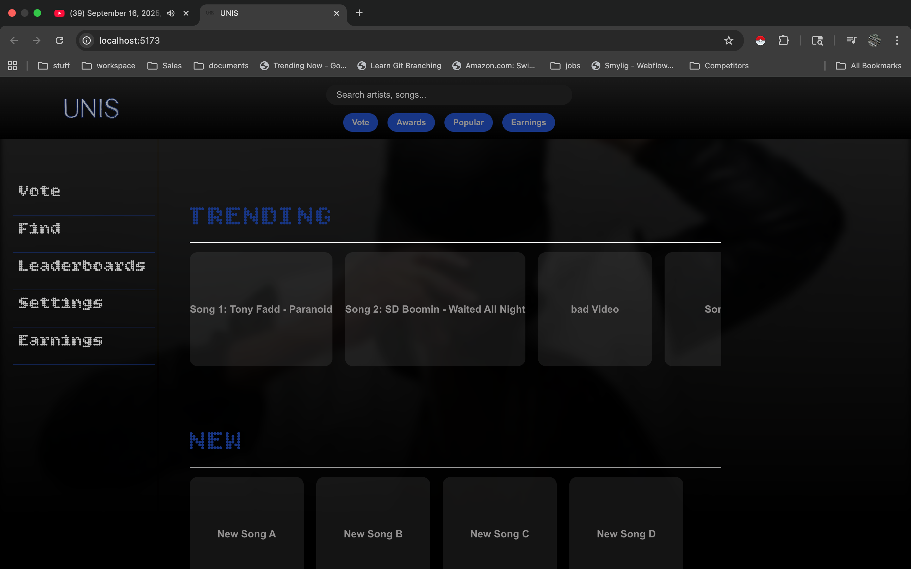

# Unis
Welcome to the future of the music industry.

Unis is a music application that allows users to determine the best music through votes and location. given users choices you are treated to the very best music by region.

Unis is a community. once you join, you select an artist to support as a part of your membership. You can change this once per month, the artist you support will receive a portion of the ad revenue generated by your activity on Unis. If you purchase a monthly subscription the artist will receive %50 of your payment. Through this community, artist are faily compensated for their hard work and receive proper recognition thought their local community.

<p align="center">
  <br>
  
  <br>
</p>
<p align="center" >
  <a href="#features">Features</a> •
  <a href="#Files">Files</a> •
  <a href="#how-to-use">How To Use</a> •
  <a href="#packages">Packages</a>   
</p>
<p align="center" >
<a href="https://unisprototype.netlify.app/">Try it out here</a> 
</p>

## Features

* How to run locally
```bash
# Install dependencies
$ npm i
# run the app
$ npm run build
```

## Files

- src: contains all of the main files and coponentes
- components: reusable pieces of code that define the appearance and behavior of a part of the UI.


## How To Use

To clone and run this application, you'll need [Git](https://git-scm.com), [Node.js](https://nodejs.org/en) and [Postgresql](https://www.postgresql.org/) installed on your computer. From your command line:

```bash
# Clone this repository
$ git clone git@github.com:cyberstizz/unis-sample.git

# Install dependencies
$ npm i

# Run the app
$ npm run build
```

## Packages

This software uses the following open source packages:

- [React](https://reactjs.org/)
- [ReactRouter](https://reactrouter.com/en/main)
- [Redux](https://redux.js.org/)
- [Express](https://expressjs.com/)
- [Stripe](https://stripe.com/)
- [PassportJs](https://www.passportjs.org/)
- [Postgresql](https://www.postgresql.org/)


### how to use it
The Unis application is not live to the public yet.


### Biggest challenges
this project began in 2007 when I did not even know what html was, so the biggest challenge was remining focused on the goal over the last 18 years and learning everything required to bring my vision to reality.


### Code Review
section coming soon.

### final thought
section coming soon

### for more projects by CyberStizz visit: [Charleslambjr.com](https://www.charleslambjr.com/)


Unis documentation

Unis Documentation
Welcome to the Unis documentation! Unis is a jurisdiction-based, music-focused user-generated content (UGC) platform designed to foster local music discovery, artist promotion, and community engagement. Built with a React frontend and Spring Boot backend, it emphasizes personalized feeds, voting/leaderboards, and automated awards to celebrate emerging talent in specific areas (e.g., Harlem neighborhoods).
This guide covers everything from high-level overviews to technical details, based on the application's current architecture and features. It's structured for different audiences: users, developers, and operators. If you're new to documentation, this follows best practices like clear hierarchy (sections/subsections), concise language, code snippets/tables for clarity, and actionable steps (e.g., setup checklists).
Current Version: v1.0 (Launch-Ready as of November 30, 2025)
Tech Stack: React (frontend), Spring Boot (backend), Supabase (DB), Render/Netlify/Cloudflare (hosting)
Key Principles: Jurisdiction-scoped (zip-restricted for launch), time-bound algorithms (daily/weekly awards), resilient fallbacks (e.g., plays for low votes).

1. Overview
What is Unis?
Unis connects music creators (artists) and listeners in hyper-local "jurisdictions" (e.g., Downtown Harlem, Uptown Harlem, Harlem-wide). Users upload songs/videos, vote on nominees, view trending/new feeds, and celebrate milestones via awards. It's UGC-first: Artists build profiles, listeners discover via personalized carousels, and community votes drive leaderboards.
Core Value Prop: "Your block's beats"—Harlem-focused at launch (zip-restricted join), scalable to Oakland/other cities. Supports 200 listeners + 30 artists out-of-the-box.
Key Features


Feature	Description	User Benefit
Personalized Feed	Trending (top views/plays last day) + New (latest uploads) carousels, jurisdiction-filtered (+hierarchy for parents like Harlem-wide).	Discover local hits without global noise.
Voting & Leaderboards	Multi-step wizard for scoped votes (genre/jur/type/interval); live rankings (votes + plays composite).	Fair, engaging fan-voting with daily limits.
Awards & Milestones	Automated snapshots (midnight cron) of tops; historical lookup with auto-backfill for missed runs.	Legacy-building: "I won Artist of the Day 100x in Harlem."
Artist Dashboard	Upload songs/videos (w/ artwork, duration auto-detect), view stats/plays.	Easy creation + analytics.
Player & Navigation	Global audio/video player; routes to song/artist/video pages.	Seamless listening/sharing.
Target Users (Launch): Listeners (zip-verified Harlem residents), Artists (30 initial, verified). Scale: Add jurisdictions via admin.
Architecture at a Glance
* Frontend: React (components like Feed.jsx, LeaderboardsPage.jsx, MilestonesPage.jsx, VotingWizard.jsx). Uses Context (PlayerContext), Axios for API, localStorage for auth.
* Backend: Spring Boot (Controllers: MediaController, VoteController; Services: MediaService, VoteService, AwardService; Entities: Song/Video/Vote/Award/User/Jurisdiction/Genre).
* Data: Supabase (Postgres) for entities (e.g., votes table w/ unique on user+scope+date); R2/S3 for media files.
* Flow: Auth → Profile (jurisdiction) → Scoped fetches (e.g., /media/trending?jurId=...) → Normalized UI.
* Security: JWT auth; zip-restrict via user.jurisdiction; dupe votes via DB constraints.
(For visuals: Imagine a diagram—Frontend → API Gateway (Cloudflare) → Render Backend → Supabase DB. Add later via Draw.io.)

2. User Guide
For end-users (listeners/artists). Assume signed in (OAuth/local token).
Getting Started
1. Sign Up/Login: Enter Harlem zip (e.g., 10026) → Auto-assign jurisdiction (e.g., Downtown Harlem). Token stores userId/jurId.
2. Profile: View/edit jurisdiction (switch later); artists upload bio/photo/genre.
3. Explore:
    * Feed (/feed): Auto-loads trending/new (5 each, mixed song/video). Play ▶ → Tracks view (+1 score via /play).
    * Leaderboards (/leaderboards): Filter jur/genre/type/interval (daily=last day) → View tops (votes+plays). Click nominee → Vote via wizard.
    * Milestones (/milestones): Pick date/jur/genre/type → See that day's winners (auto-fills if missed). E.g., "Nov 27, 2025 Artist in Rap/Downtown Harlem."
Voting Flow
1. Browse leaderboards → Click nominee (e.g., artist "Tony Fadd").
2. VotingWizard Opens: Step 1 (review/edit filters: genre=rap, type=artist, interval=daily, jur=downtown-harlem). Step 2 (summary: "Vote for Tony Fadd as Artist of the Day"). Step 3 (type name forward/backward → Anti-bot CAPTCHA).
3. Submit: POST /vote/submit (scoped) → If dupe ("already voted today"), error. Success: +1 vote, leaderboard refreshes (+1 score).
Limits: 1 vote/user/target/scope/day. Eligibility: Own/parent jur only.
Awards & Milestones
* How Generated: Midnight cron snapshots daily tops (votes >0, per jur/genre/song/artist). Missed? Auto-compute on milestone fetch (from historical votes/plays).
* View Milestones: Select date (up to yesterday) → Shows #1 highlight + ranked list (votes, caption). E.g., for 2025-11-27: If no award, pulls live tops as provisional.
* Historical Queries: Single-date now; future: Add range for "all 2025 wins" (COUNT per artist).
Tips: Plays count as engagement (fallback for low votes). Share wins via social (add export?).

3. Developer Guide
For contributors. Assumes Java/Node.js basics.
Setup
Prerequisites
* Node.js 18+, Java 17+, Docker (for Supabase local).
* Env: VITE_API_BASE_URL=http://localhost:8080 (frontend); DB_URL (Supabase).
Backend (Spring Boot)
1. Clone repo → cd backend → ./mvnw spring-boot:run (or IDE).
2. DB: Supabase project → Run migrations (Flyway: entities like votes/awards).
3. Seed: Insert test users/artists/songs (e.g., SQL: 30 Harlem artists, 100 plays/votes on 2025-11-27).
4. Test: Postman /media/trending?jurId=harlem-uuid&limit=5 → Expect mixed song/video by score DESC.
Frontend (React)
1. cd frontend → npm install → npm run dev.
2. Auth: localStorage 'token' (JWT w/ userId).
3. Test: Login → /feed → Play song → Check Network: POST /media/song/{id}/play?userId=...
End-to-End
* Run both → Login (test user Harlem zip) → Vote → Check milestones for auto-award.
Common Issues:
* CORS: Backend @CrossOrigin("*").
* Media URLs: buildUrl prepends API_BASE_URL for local; absolute for prod (R2).
* Cron TZ: Server EST (Render env var TZ=America/New_York).
API Reference
Swagger at /swagger-ui.html (backend). Key endpoints:


Method	Endpoint	Description	Params/Example
GET	/v1/media/trending	Jurisdiction feed trending (views/plays last day).	?jurisdictionId=uuid&limit=5
GET	/v1/media/new	Newest uploads (songs-only, recency DESC).	?jurisdictionId=uuid&limit=5
POST	/v1/media/song/{id}/play	Track play (+1 score).	?userId=uuid
POST	/v1/vote/submit	Scoped vote (dupe-check).	Body: {userId, targetType, ...}
GET	/v1/vote/leaderboards	Live tops (votes+plays, interval range).	?jurId=uuid&genreId=uuid&type=artist&intervalId=daily&limit=50&playsOnly=true
GET	/v1/awards/past	Historical awards (auto-backfill).	?type=song&startDate=2025-11-27&endDate=2025-11-27&jurId=uuid&genreId=uuid
POST	/v1/awards/compute	Manual cron (backfill).	?intervalId=daily&jurId=uuid&genreId=uuid&date=2025-11-27
Error Handling: 400/500 → JSON {message}; frontend fallbacks to dummies.
Algorithms Deep Dive
* Trending/New (MediaService): Native queries w/ hierarchy CTE → Score DESC (plays, all-time; gap: no 24h filter—add WHERE createdAt > now-24h). Fallback: Oldest globals.
* Voting (VoteService): Dupe via repo.existsBy... → Aggregate COUNT(votes) + COUNT(plays) BETWEEN dates (daily=2025-11-27 only post-fix). Fallback: Plays-only if <5.
* Awards (AwardService): Cron snapshots tops (votes>0, per scope/date) → Unique constraint dupes. On fetch: Auto-compute if empty → Synthetics (top scores). Multi-interval (weekly Monday, etc.).
Improvements Queue (From Assessment):
1. Tighten daily to exact date (VoteService).
2. Pass playsOnly (VoteController).
3. Add videos to crons (AwardService).
4. Backfill endpoint (AwardService).
5. Indexes/caching for scale.

4. Operations Guide
Deployment
* Frontend: Netlify (git connect) → Auto-deploys on push.
* Backend: Render (Dockerfile: Spring Boot jar) → Env vars (DB_URL, JWT_SECRET).
* DB: Supabase (Postgres) → Enable RLS for zip-restrict (policy: user.jurisdiction IN Harlem zips).
* Media: Cloudflare R2 (storeFile → Signed URLs).
* Monitoring: Supabase logs; Render metrics; Sentry for errors.
Scaling Notes
* Launch (200 users): Free tiers suffice.
* 1k DAU: Upgrade Supabase ($25/mo); add Redis cache.
* Crons: Render sleeps? Migrate to always-on ($20/mo) or Railway.
Troubleshooting
* No Awards on Milestones: Check logs ("Auto-populating") → Run manual /awards/compute.
* Slow Feed: Add indexes (votes.voteDate); cache trending (5min TTL).
* Zip Restrict: UserService: Validate zip → Assign jur (e.g., 10026 → downtown-harlem).

5. Contributing & Future Roadmap
Contributing
* Fork → Branch (feat/voting-fixes) → PR w/ tests.
* Linting: ESLint (frontend), Spotless (backend).
* Tests: JUnit (backend: mock repos for aggregates); Jest/Cypress (frontend: e2e voting flow).
Roadmap
* v1.1 (Q1 2026): Video awards, range milestones ("wins in 2025"), social sharing.
* v1.5: Multi-city (Oakland jur), WebSockets for live votes.
* v2.0: ML recs (beyond plays/votes).
License: MIT (open-source core; proprietary media).
